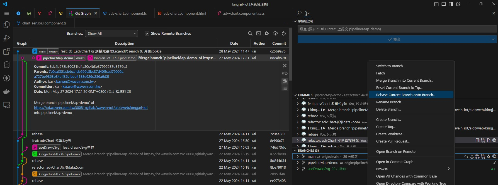
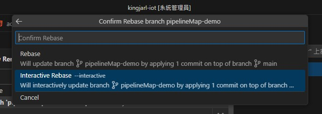
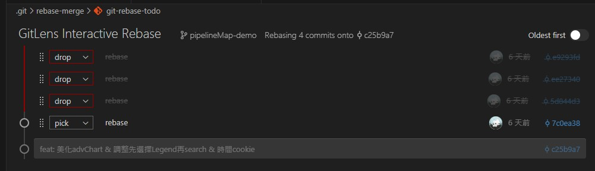
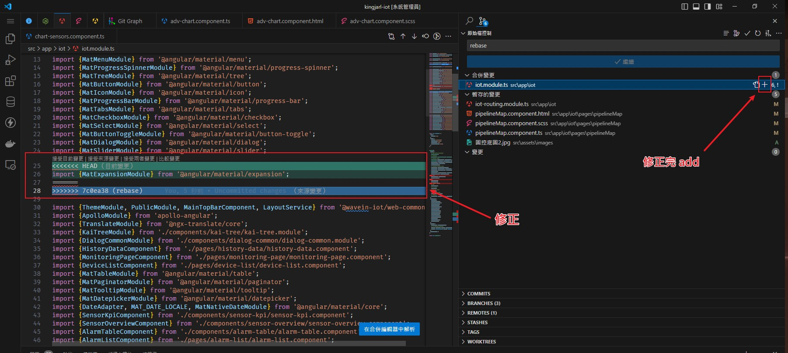

```shell


# log: 查看log (用Git Graph UI看比較清楚)
git log


# reset: 退回指定commit 並讓所有變更轉為暫存變更
# 當分支異常時可用此指令壓縮中間的commit, 但會遺失中間所有的commit
# reset 也可以讓分支直接 reset到最新主分支 來讓整棵樹恢復乾淨
git reset [<commit>]
git reset 26630dffd7d976a0a8b69673cf76550c0a22370d


# rebase: 將目前分支 轉基底至 指定分支
# 開發其他功能的分支時，當主分支有更新， 可用rebase將功能分支 轉基底至 最新主分支
git rebase [<branch>]
git rebase main

git rebase --abort # rebase中途 取消rebase
git rebase --continue # rebase中途 繼續rebase


```

# 情形1: B分支 rebase A 但遇到多個commit需修改
可使用 rebase --interactive 來個別調整各commit處理
### 1. 選擇要rebase的分支

### 2. 選擇 rebase --interactive

### 3. 調整各commit處理 [參考](https://www.gss.com.tw/blog/%E4%BD%BF%E7%94%A8-git-rebase-interactive-%E6%A8%A1%E5%BC%8F%E6%95%B4%E7%90%86-commit)

### 4. 處理rebasing合併
