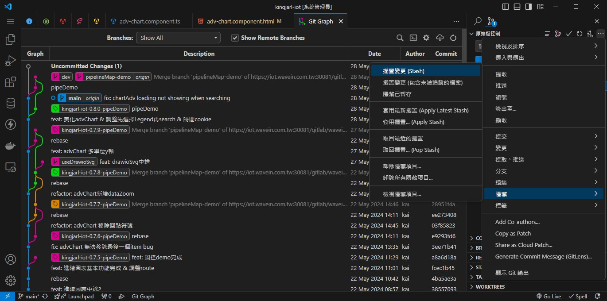
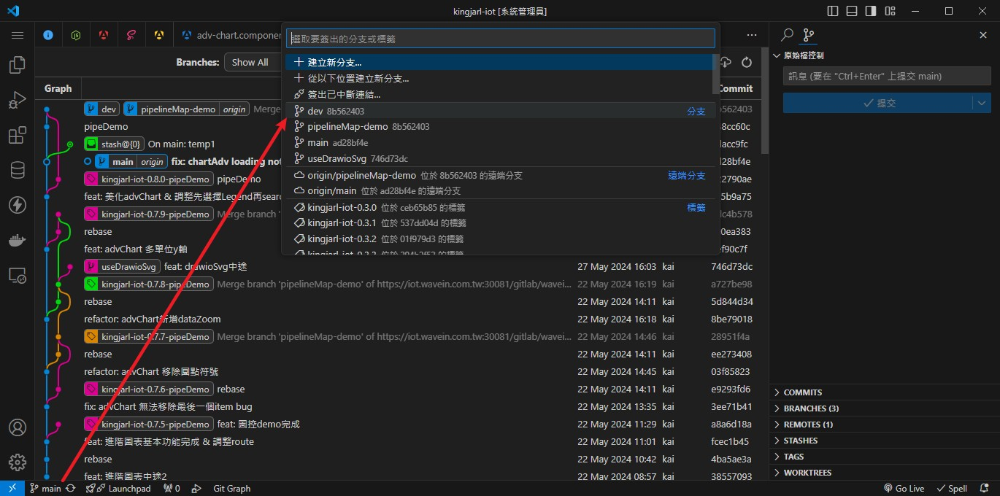
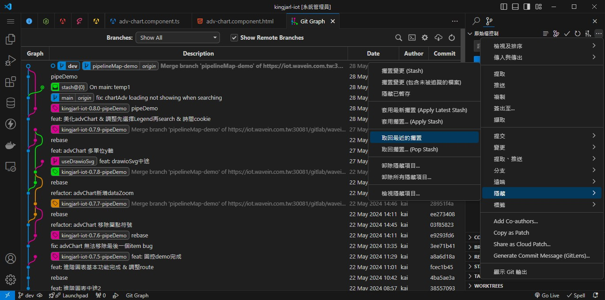

# 情形1:
```
有 A B 分支  
應該要在A分支開發，但目前在B分支忘記切換就改了
有什麼辦法切換到A分支，並保留目前修改
```

> 可使用 git stash 擱置變更

## 使用指令 :
```shell
# 擱置當前的修改
git stash

# 切換分支A
git checkout A

# 恢復擱置修改 並刪除該擱置 (pop最新的擱置)
git stash pop
```

## 使用vscode :
### 1. stash修改

### 2. checkout分支

### 3. pop最新的擱置
