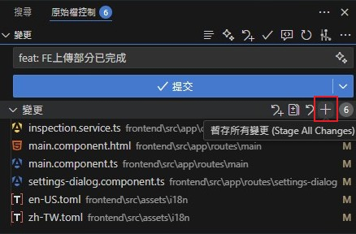
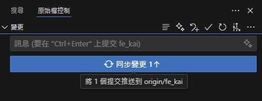

# 安裝參考

~~[下載](https://git-scm.com/download/win)~~

[Git教學](https://www.runoob.com/git/git-basic-operations.html)

建議用 scoop 安裝，參考[Scoop](../scoop(win包管理)/新機初始安裝.md)


### 建立存放庫初始化

```shell
git init
```

### 暫存變更_add

```shell
git add .         # 暫存全部
git add 路徑檔案
```

### 取消暫存變更_reset

```shell
git reset .       # 取消暫存全部
git reset 路徑檔案
```

### 提交_commit

```shell
git commit -m "填寫版本資訊"
```

### 反悔提交_Undo commit


### 擱置變更


```shell
git stash      # 擱置當前的修改
git checkout A # 切換分支A
git stash pop  # 恢復擱置修改 並刪除該擱置 (pop最新的擱置)
```

__________________________________________________

## 【遠端連接】
[參考這裡](https://www.runoob.com/git/git-remote.html)

### 新增遠端存儲庫_remote

```shell
git remote add <name> <url>   # 新增
git remote remove <name>      # 移除
git remote rename <old> <new> # 重命名
```

__________________________________________________

## 【遠端同步】

### clone_複製遠端專案到本地

```shell
git clone <repository-url>
```

### push_推

```shell
git push                   # 預設push
git push -f                # 強制push
git push <remote> <branch> # 指定push
```

### fetch_抓取(僅下載) & pull_拉(下載並合併)

```shell
git fetch origin
git pull <remote> <branch>
git pull origin main
```

__________________________________________________

## 【分支】

### branch_建立分支

```shell
git branch 分支名     # 建立分支
git branch -d 分支名  # 刪除分支
```

### checkout_切換分支


```shell
git checkout 分支名
```

### rebase_合併分支


```shell
# 目前分支B 合併 分支A (將分支B與分支A的分支處之中的提交 移到分支A開始)
git checkout 分支B
git rebase 分支A
# or
git checkout dev
git rebase main
```

### merge_合併分支
[其他合併方式參考](https://stackoverflow.com/questions/9069061/what-effect-does-the-no-ff-flag-have-for-git-merge)


```shell
# 目前分支A 合併 分支B (將B的更新 給A)
git checkout 分支A
git merge 分支B
# or
git checkout main
git merge dev
```

若發生 fatal: refusing to merge histories

須強制合併，使用以下命令

```shell
git merge 分支B --allow-unrelated-histories
# or
git merge dev --allow-unrelated-histories
```

合併後，若有衝突，需手動處理，

在git面板可以看到有衝突的檔案，

手動處理好後，按"+"暫存變更，

都處理好後，"提交(commit)"才會亮起來給你按。

__________________________________________________

