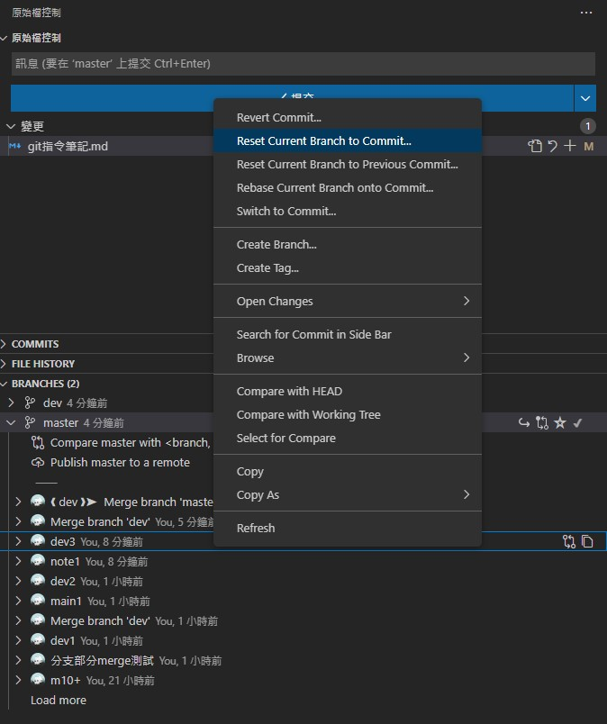

## 【特殊處理】

### 回復版本

```shell
git reset --hard HEAD    # 回復到最新提交版本
git reset --hard HEAD~   # 等於 ~1 回復到上一個提交版本
git reset --hard HEAD~n  # n 等於往上第幾個提交版本 回復之前指定的提交版本
```

### 合併(merge)時忽略指定檔案
[參考](https://stackoverflow.com/questions/14369378/how-to-make-git-ignore-a-directory-while-merging)
```shell
git checkout main    
git merge --no-commit --no-ff development
git reset -- /path/to/folder # revert updates from path
git commit

簡易說明:
1. 先 main 合併(merge) dev
2. 捨棄(reset) 不要合併的檔案
3. commit
```

### 將舊commit的作者和email改掉

```shell
pip install git-filter-repo

git filter-repo --email-callback 'return b"wkai2573@gmail.com"' --name-callback 'return b"kai"'
```